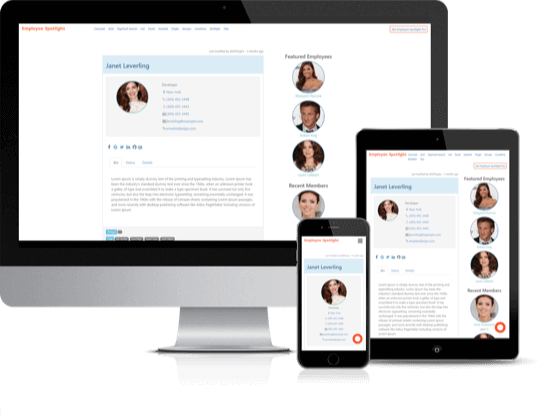

<!-- PROJECT LOGO -->
 

  

  <h3 align="center">Employee Spotlight</h3>

  

    Team, staff, employee WordPress plugin to showcase each member of your team in a beautiful, and easy way.
     
     
     <a href="https://github.com/emarket-design/employee-spotlight/issues">Report Bug</a>
    ·
    <a href="https://github.com/emarket-design/employee-spotlight/issues">Request Feature</a>
     

<!-- ABOUT THE PROJECT -->
## About The Project

<ul>
<li>Beautiful, responsive employee profile management with 100+ unique displays</li>
<li>Power up member, staff bios with custom fields</li>
<li>Display optional 5 social links for each member</li>
<li>Profile owners can update profile pages</li>
<li>Showcase featured members or staff, new hires and upcoming birthdays on your site's sidebar</li>
<li>Customizable employee profile pages.</li>
<li>Integrated advanced CSV importer/exporter</li>
<li>Sync with Microsoft Active Directory and LDAPv3 using <a href="/emd-active-directory-ldap-extension/">eMD Active Directory/LDAP plugin</a> (sold separately)</li>
<li>Integrated Visual Shortcode Builder for unique displays</li>
</ul>

### Related WordPress Plugins

* [Employee Directory Starter](https://employee-directory-com.emdplugins.com) The most complete employee directory software to power up your business.
* [Campus Directory Starter](https://campusdircom.emdplugins.com) The Best Campus Directory for Higher Education Institutions.
* [WP Easy Contact Starter](https://wpeasycontactcom.emdplugins.com) Complete contact management solution to start, develop and grow your customer relationships.

### Features

* [Organize employee information for faster searches.](https://emdplugins.com/?p=10449&pk_campaign=employee-spotlight-com&pk_kwd=github)
* [Let everyone see your team's talend from any device.](https://emdplugins.com/?p=10447&pk_campaign=employee-spotlight-com&pk_kwd=github)
* [Beautiful employee profile pages.](https://emdplugins.com/?p=10446&pk_campaign=employee-spotlight-com&pk_kwd=github)
* [One central location from all employee information.](https://emdplugins.com/?p=10445&pk_campaign=employee-spotlight-com&pk_kwd=github)
* [Create custom fields and display them easily.](https://emdplugins.com/?p=10448&pk_campaign=employee-spotlight-com&pk_kwd=github)
* [Powerful and easy to use customization tools.](https://emdplugins.com/?p=10450&pk_campaign=employee-spotlight-com&pk_kwd=github)
* [99 different ways to display team members.](https://emdplugins.com/?p=10454&pk_campaign=employee-spotlight-com&pk_kwd=github) - Premium feature (included both Pro and Ent)
* [Assign more responsibilities to your staff by powerful permissions engine.](https://emdplugins.com/?p=10828&pk_campaign=employee-spotlight-com&pk_kwd=github) - Premium feature (included both Pro and Ent)
* [Let team members find each other by powerful tag cloud search.](https://emdplugins.com/?p=10827&pk_campaign=employee-spotlight-com&pk_kwd=github) - Premium feature (included both Pro and Ent)
* [Celebrate employee with milestone widgets.](https://emdplugins.com/?p=10451&pk_campaign=employee-spotlight-com&pk_kwd=github) - Premium feature (included both Pro and Ent)
* [Let team members update their own info.](https://emdplugins.com/?p=10453&pk_campaign=employee-spotlight-com&pk_kwd=github) - Premium feature (included both Pro and Ent)
* [Display team members exactly how you want by drag and drop.](https://emdplugins.com/?p=10452&pk_campaign=employee-spotlight-com&pk_kwd=github) - Premium feature (included both Pro and Ent)
* [Offer a seamless look for your brand across your website](https://emdplugins.com/?p=10457&pk_campaign=employee-spotlight-com&pk_kwd=github) - Premium feature (included both Pro and Ent)
* [Keep everyone posted on new hires.](https://emdplugins.com/?p=10455&pk_campaign=employee-spotlight-com&pk_kwd=github) - Premium feature (included both Pro and Ent)
* [Decide who has access to what with custom user roles.](https://emdplugins.com/?p=10458&pk_campaign=employee-spotlight-com&pk_kwd=github) - Premium feature (included both Pro and Ent)
* [Create advanced shortcodes with a few clicks.](https://emdplugins.com/?p=10456&pk_campaign=employee-spotlight-com&pk_kwd=github) - Premium feature (included both Pro and Ent)
* [Frontend editing of all available employee profile fields including employee photos - perfect for non-technical user adoption of your system.](https://emdplugins.com/?p=12050&pk_campaign=employee-spotlight-com&pk_kwd=github) - Premium feature (Included in Ent only)
* [Control who can see, create and update existing employee field values from plugin settings.](https://emdplugins.com/?p=12049&pk_campaign=employee-spotlight-com&pk_kwd=github) - Premium feature (Included in Ent only)
* [Show employee and office locations on Google Maps](https://emdplugins.com/?p=15833&pk_campaign=employee-spotlight-com&pk_kwd=github) - Premium feature (included both Pro and Ent)
* [Alphabetical search on name, department or job title of an employee.](https://emdplugins.com/?p=12602&pk_campaign=employee-spotlight-com&pk_kwd=github) - Premium feature (included both Pro and Ent)
* [Sync employee records with Microsoft Active Directory/LDAP.](https://emdplugins.com/?p=10617&pk_campaign=employee-spotlight-com&pk_kwd=github) - Add-on (Included in Ent only)
* [Import/export employee records from/to CSV easily.](https://emdplugins.com/?p=14801&pk_campaign=employee-spotlight-com&pk_kwd=github) - Add-on (included both Pro and Ent)
* [Save employee information as vcard.](https://emdplugins.com/?p=10462&pk_campaign=employee-spotlight-com&pk_kwd=github) - Add-on (Included in Ent only)
* [Search and organize employee information.](https://emdplugins.com/?p=14802&pk_campaign=employee-spotlight-com&pk_kwd=github) - Add-on (Included in Ent only)

<!-- GETTING STARTED -->
## Getting Started

### Watch Introduction Video 

 

To get a local copy up and running follow these simple example steps.

### Employee Spotlight WordPress Plugin Links

 * [Employee Spotlight Starter Demo Site](https://espotlight-com.emdplugins.com?pk_campaign=employee-spotlight-com&pk_kwd=readme)
* [Employee Spotlight Starter Documentation](https://docs.emdplugins.com/employee-spotlight-community/?pk_campaign=employee-spotlight-com&pk_kwd=readme)
* [Employee Spotlight Professional Demo Site](https://espotlight.emdplugins.com/?pk_campaign=employee-spotlight-com&pk_kwd=readme)
* [Employee Spotlight Professional Documentation](https://docs.emdplugins.com/employee-spotlight-professional/?pk_campaign=employee-spotlight-com&pk_kwd=readme)
* [Employee Spotlight Professional Changes](https://emdplugins.com/articles/empslight-pro-wordpress-plugin-changelog/?pk_campaign=employee-spotlight-com&pk_kwd=readme)
* [Employee Spotlight Enterprise Demo Site](https://espotlight.emdplugins.com/?pk_campaign=employee-spotlight-com&pk_kwd=readme)
* [Employee Spotlight Enterprise Documentation](https://docs.emdplugins.com/employee-spotlight-enterprise/?pk_campaign=employee-spotlight-com&pk_kwd=readme)
* [Employee Spotlight Enterprise Changes](https://emdplugins.com/articles/empslight-ent-wordpress-plugin-changelog/?pk_campaign=employee-spotlight-com&pk_kwd=readme)

### Installation

#### Using This Page
* Click on Clone or Download button on this page. Click, and you can see a drop-down box having two options, click on Download ZIP.
* Login to your website and go to the Plugins section of your admin panel.
* Click the Add New button.
* Under Install Plugins, click the Upload link.
* Select the plugin zip file from your computer then click the Install Now button.
* You should see a message stating that the plugin was installed successfully.
* Click the Activate Plugin link.

#### Using WordPress

The simplest way to install is to click on WordPress 'Plugins' page then 'Add' and type 'Employee Spotlight' in the search field.

##### Manual Installation Type 1

* Login to your website and go to the Plugins section of your admin panel.
* Click the Add New button.
* Under Install Plugins, click the Upload link.
* Select the plugin zip file from your computer then click the Install Now button.
* You should see a message stating that the plugin was installed successfully.
* Click the Activate Plugin link.

##### Manual Installation Type 2

* You should have access to the server where WordPress is installed. If you don't, see your system administrator.
* Copy the plugin zip file up to your server and unzip it somewhere on the file system.
* Copy the "employee-spotlight" folder into the /wp-content/plugins directory of your WordPress installation.
* Login to your website and go to the Plugins section of your admin panel.
* Look for "Employee Spotlight" and click Activate.

<!-- CONTRIBUTING -->
## Contributing

Contributions are what make the open source community such an amazing place to learn, inspire, and create. Any contributions you make are **greatly appreciated**.

1. Fork the Project
2. Create your Feature Branch (`git checkout -b feature/AmazingFeature`)
3. Commit your Changes (`git commit -m 'Add some AmazingFeature'`)
4. Push to the Branch (`git push origin feature/AmazingFeature`)
5. Open a Pull Request

<!-- LICENSE -->
## License

Distributed under the GPLv2 or later License. See [`LICENSE`](https://www.gnu.org/licenses/gpl-2.0.html) for more information.

<!-- CONTACT -->
## MORE INFO

[Employee Spotlight](https://emdplugins.com/plugins/employee-spotlight-wordpress-plugin/) - WORDPRESS PLUGIN PAGE